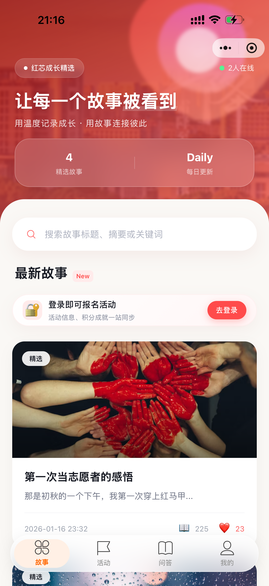
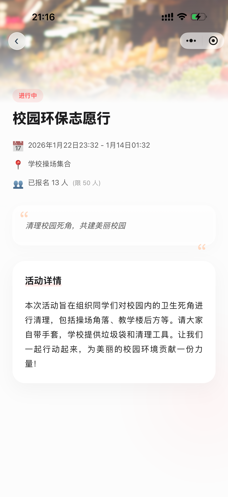
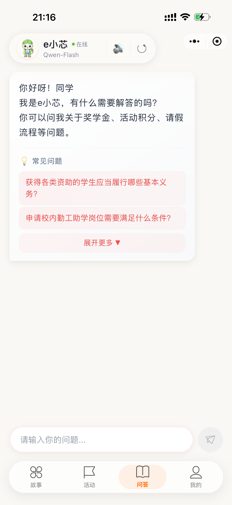
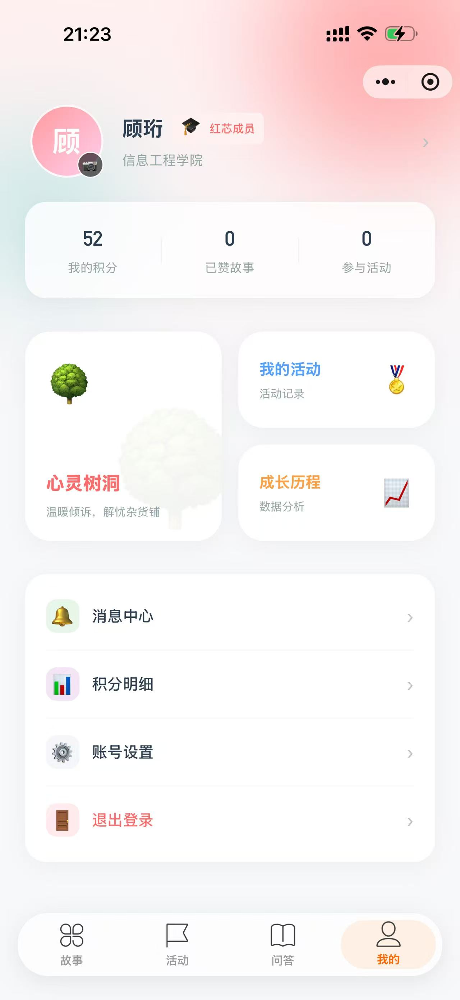
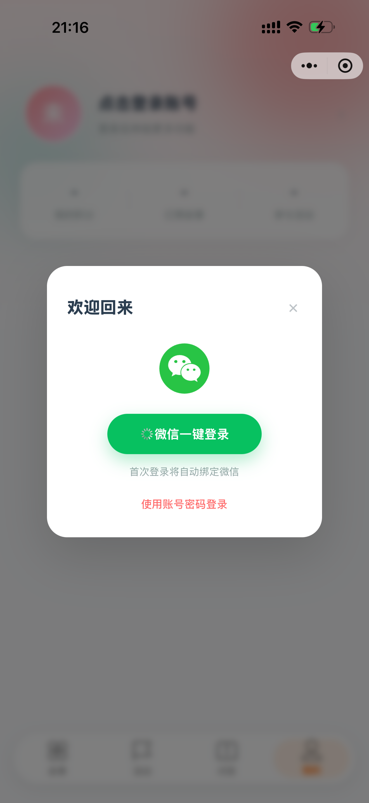
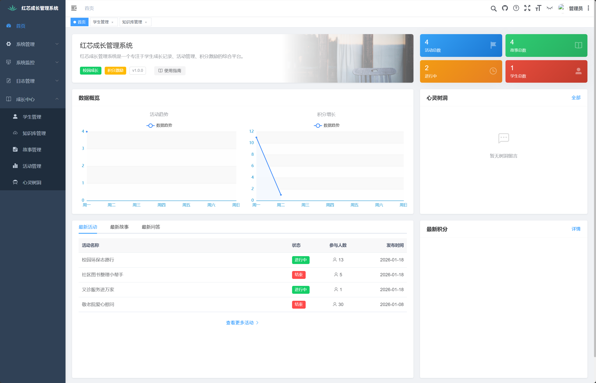

# 红芯成长（HXCZ）

> 面向校园场景的“成长 + 活动 + AI 问答”一体化小程序与管理后台。

[](LICENSE)
[](honxinggrow-end/pom.xml)
[](honxinggrow-end/ruoyi-ui/package.json)
[](honxinggrow-front/app.json)

---

## 项目简介

**红芯成长**是一个基于 [若依 RuoYi-Vue 3.9.0](https://gitee.com/y_project/RuoYi-Vue) 脚手架开发的校园成长服务平台，包含：

- **微信小程序端**：学生可浏览成长故事、报名校园活动、参与 AI 问答、投递心灵树洞、查看积分与消息通知。
- **管理后台（Vue2 + Element UI）**：教师 / 管理员可发布故事与活动、审核活动证明、管理积分、配置 AI 模型、查看树洞与消息等。
- **后端服务（Spring Boot）**：提供 RESTful API、微信小程序登录、AI 流式对话、TTS 语音合成、文件上传、定时任务等能力。

---

## 界面预览

### 小程序端

| 主页 | 活动列表 | 活动详情 |
| --- | --- | --- |
|  |  |  |

| AI 问答 | 个人中心 | 登录 |
| --- | --- | --- |
|  |  |  |

### 管理后台

| 后台管理主页 |
| --- |
|  |

---

## 功能特性

### 小程序端

- 成长故事浏览、点赞、收藏（[pages/index/index](honxinggrow-front/pages/index/index.js)）
- 校园活动查看、报名、上传参与证明（[pages/activity/activity](honxinggrow-front/pages/activity/activity.js)）
- AI 智能问答：支持流式输出、Markdown 渲染、语音播报（TTS）（[pages/qa/qa](honxinggrow-front/pages/qa/qa.js)）
- 心灵树洞：匿名/实名投递与历史记录（[pages/treehole](honxinggrow-front/pages/treehole/)）
- 成长积分：积分账户、积分明细、成长历史（[pages/pointsDetail](honxinggrow-front/pages/pointsDetail/)）
- 消息中心：系统通知、未读红点（[pages/messageCenter](honxinggrow-front/pages/messageCenter/)）
- 账号绑定：微信快捷登录、账号密码登录（[utils/request.js](honxinggrow-front/utils/request.js)）

### 管理后台

- 成长故事管理（[ruoyi-ui/src/views/hx/story](honxinggrow-end/ruoyi-ui/src/views/hx/story/index.vue)）
- 成长活动管理、报名记录与证明审核（[ruoyi-ui/src/views/hx/activity](honxinggrow-end/ruoyi-ui/src/views/hx/activity/index.vue)）
- 学生积分管理（[ruoyi-ui/src/views/hx/points](honxinggrow-end/ruoyi-ui/src/views/hx/points/index.vue)）
- AI 问答配置（模型、提示词、参数等）（[ruoyi-ui/src/views/hx/qa](honxinggrow-end/ruoyi-ui/src/views/hx/qa/index.vue)）
- 心灵树洞管理（[ruoyi-ui/src/views/system/hole](honxinggrow-end/ruoyi-ui/src/views/system/hole/index.vue)）
- 若依原生能力：用户 / 角色 / 菜单 / 部门 / 岗位 / 字典 / 日志 / 监控 / 代码生成等

### 后端服务

- 基于 Spring Boot 2.5.15 + Spring Security 的多角色权限体系
- 小程序 API：故事、活动、积分、消息、树洞、登录认证（[web/controller/app](honxinggrow-end/ruoyi-admin/src/main/java/com/ruoyi/web/controller/app/)）
- AI 能力：非流式对话、SSE 流式对话、TTS 语音合成、模型配置（[HxAiController.java](honxinggrow-end/ruoyi-admin/src/main/java/com/ruoyi/web/controller/hx/HxAiController.java)）
- 数据访问：MyBatis + Druid + PageHelper，支持 MySQL
- 缓存与会话：Redis
- 定时任务：Quartz
- 文件上传与静态资源访问

---

## 技术栈

| 层级 | 技术 |
| --- | --- |
| 后端 | Java 8、Spring Boot 2.5.15、Spring Security、MyBatis、Druid、PageHelper、JWT、Fastjson2 |
| 后台前端 | Vue 2.6、Vuex、Vue Router、Element UI 2.15、ECharts、Axios |
| 小程序端 | 原生微信小程序（WXML/WXSS/JS）、微信云函数（可选）、自定义 TabBar |
| 数据库 | MySQL 5.7+ |
| 缓存 | Redis 5.0+ |
| AI / TTS | 通义千问模型（可配置）、qwen3-tts-flash |

---

## 项目结构

```text
HXCZ/
├── honxinggrow-end/          # 后端与管理后台
│   ├── ruoyi-admin/          # Web 入口与 Controller
│   ├── ruoyi-system/         # 业务 Service / Mapper / Domain
│   ├── ruoyi-framework/      # 框架配置、安全、拦截器
│   ├── ruoyi-common/         # 公共工具类
│   ├── ruoyi-quartz/         # 定时任务
│   ├── ruoyi-generator/      # 代码生成器
│   ├── ruoyi-ui/             # Vue2 管理后台
│   └── sql/                  # 数据库脚本
├── honxinggrow-front/        # 微信小程序源码
│   ├── pages/                # 小程序页面
│   ├── utils/                # 工具类（请求、TTS、上传等）
│   ├── cloudfunctions/       # 微信云函数
│   └── images/               # 图片资源
├── photo/                    # 项目截图
├── upload/                   # 运行时上传文件目录
├── .env.example              # 环境变量示例
├── LICENSE                   # 版权声明
└── README.md                 # 本文件
```

---

## 快速开始

### 1. 环境准备

- JDK 1.8+
- Maven 3.6+
- MySQL 5.7+
- Redis 5.0+
- Node.js 14+（后台前端）
- 微信开发者工具（小程序端）

### 2. 初始化数据库

依次执行 `honxinggrow-end/sql/` 下的脚本（具体文件名以本地为准）：

1. `ry_20250522.sql` — 若依基础库
2. `hx_tables.sql` — 成长系统业务表
3. `quartz.sql` — 定时任务表
4. 其余以日期命名的增量脚本（如活动证明、积分配置、消息、树洞等）

> 默认数据库名可参考根目录 `.env.example` 中的 `MYSQL_DATABASE=yzpc`。

### 3. 启动后端

编辑 `honxinggrow-end/ruoyi-admin/src/main/resources/application.yml`：

- 配置 MySQL 连接
- 配置 Redis 连接
- 配置微信小程序 `appid` 与 `secret`
- 配置文件上传路径 `ruoyi.profile`

然后启动：

```bash
cd honxinggrow-end
mvn clean install
mvn -pl ruoyi-admin spring-boot:run
```

或者通过 IDE 直接运行 `ruoyi-admin/src/main/java/com/ruoyi/RuoYiApplication.java`。

默认后端地址：`http://localhost:8080`

### 4. 启动管理后台

```bash
cd honxinggrow-end/ruoyi-ui
npm install
npm run dev
```

默认访问：`http://localhost:80`

若依默认账号：`admin` / `admin123`

### 5. 运行微信小程序

1. 打开微信开发者工具，导入 `honxinggrow-front` 目录。
2. 在 `honxinggrow-front/config/env.js` 中确认 API 基础地址。
3. 修改或配置合法域名、AppID。
4. 编译并预览。

---

## 配置说明

### 后端关键配置

`honxinggrow-end/ruoyi-admin/src/main/resources/application.yml`：

| 配置项 | 说明 |
| --- | --- |
| `server.port` | 后端端口，默认 `8080` |
| `spring.redis.*` | Redis 连接信息 |
| `ruoyi.profile` | 文件上传根目录 |
| `wx.miniapp.appid` / `secret` | 微信小程序凭证 |
| `token.secret` / `expireTime` | JWT 密钥与有效期 |

### 环境变量示例

根目录 `.env.example` 提供了容器化或脚本部署时的常用变量：

```ini
TZ=Asia/Shanghai
MYSQL_ROOT_PASSWORD=root
MYSQL_DATABASE=yzpc
MYSQL_USER=ruoyi
MYSQL_PASSWORD=ruoyi
MYSQL_PORT=3306
REDIS_PORT=6379
BACKEND_PORT=8080
ADMIN_PORT=8081
JAVA_OPTS=-Dlog.path=/data/logs
```

---

## 核心 API 分组

| 前缀 | 说明 |
| --- | --- |
| `/app/story/**` | 成长故事接口 |
| `/app/activity/**` | 校园活动接口（报名、证明上传） |
| `/app/points/**` | 积分与成长历史接口 |
| `/app/message/**` | 消息通知接口 |
| `/app/treehole/**` | 心灵树洞接口 |
| `/app/wechat/**` | 微信登录 / 绑定接口 |
| `/hx/ai/**` | AI 对话 / TTS / 配置接口 |
| `/system/hole/**` | 管理端树洞管理 |
| `/hx/**` | 管理端成长系统接口 |

完整接口文档可在后端启动后访问 Swagger（若开启）：`http://localhost:8080/swagger-ui/index.html`

---

## 部署提示

- 生产环境请修改 `token.secret`、`wx.miniapp.appid/secret`、数据库密码等敏感配置。
- 建议为 `upload/` 目录配置独立静态资源服务或 Nginx 反向代理。
- 小程序线上版本需在「微信小程序后台」配置 `request 合法域名`、`uploadFile 合法域名`。
- 若使用 Nginx 部署管理后台，可参考 `honxinggrow-end/ruoyi-ui/nginx.conf`。

---

## 许可证

版权所有 © 2026 顾珩。详见 [LICENSE](LICENSE)。

---

## 作者与仓库

- 维护者：顾珩
- GitHub：[Naomi502/HXCZ](https://github.com/Naomi502/HXCZ)
- Issue 反馈：[Issues](https://github.com/Naomi502/HXCZ/issues)
